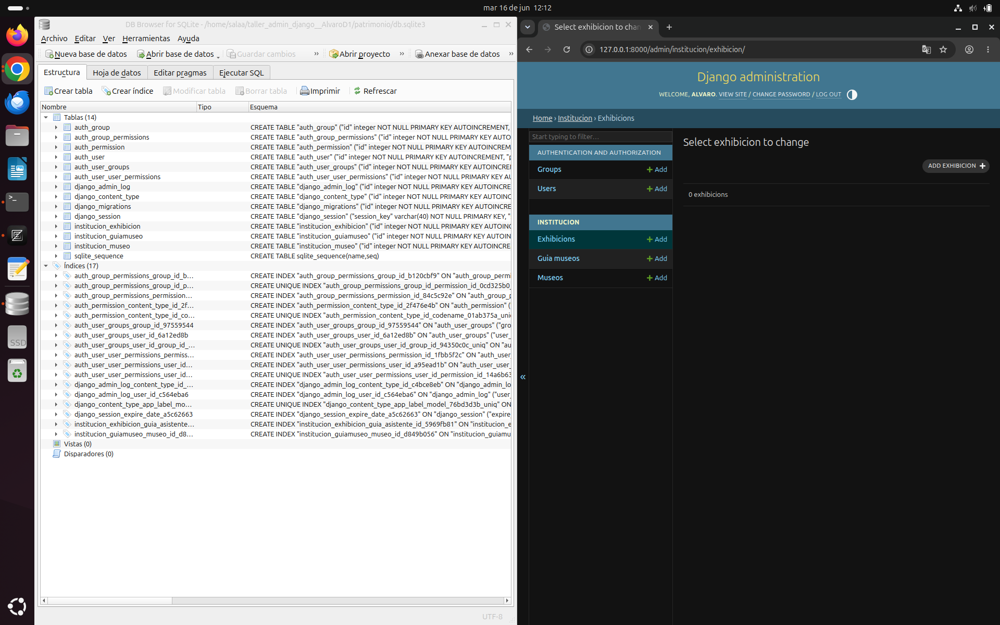

# taller_admin_django

## Escenarios de Verificación de Base de Datos

A continuación se presentan las evidencias del correcto funcionamiento del panel de administración de Django y la persistencia de datos en dos motores de bases de datos distintos (SQLite y PostgreSQL).

### Escenario 1: SQLite (Entorno de Desarrollo Local)
En este escenario se demuestra la consistencia de los datos almacenados de forma local utilizando **SQLiteBrowser** en conjunto con el **Admin de Django**.



### Escenario 2: PostgreSQL
En este escenario se migró el proyecto para trabajar con un motor robusto en red. Se utilizó **Docker** para levantar el contenedor de PostgreSQL y la herramienta **pgAdmin** para la inspección visual, sincronizado en tiempo real con el **Admin de Django**.

#### Configuración utilizada en `settings.py`:
```python
DATABASES = {
    'default': {
        'ENGINE': 'django.db.backends.postgresql',
        'NAME': 'mi_basedatos',
        'USER': 'mi_usuario',
        'PASSWORD': 'mi_password',
        'HOST': 'localhost',  # O la IP del servidor/contenedor
        'PORT': '5432',
    }
}
